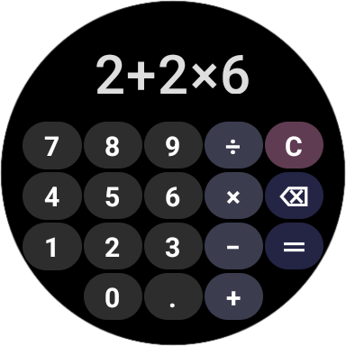

# QuickCalc - Simple calculator app for WearOS

I got a Pixel Watch 2 and was surprised to find that there was no calculator app. So I made a quick and simple one that does the job. I know you could just use Google Assistant, but I wanted something that I could use without having to speak to my watch in public lol.

I designed it specifically for the Pixel Watch 2 (which is round), so it might not look great on other watches.

I based it on the stock Pixel calculator, and styled it to match my Material You colour scheme. Feel free to fork and change the colours to match your own theme.

## Features

- Horizontally scrollable display
- Backspace button
- Stock appearance

## Screenshots

## Installation

Now available on the Google Play store!

OR

1. Download the latest release from the [releases page](releases)
2. Activate Developer Mode on your watch (click on the build number 7 times)
3. Enable Wireless Debugging in Developer Options
4. Use ADB on your computer to Pair and Connect to your watch via Wireless Debugging. Official instructions on that [here](https://developer.android.com/training/wearables/get-started/debugging)
5. Once connected, type `adb install <path to QuickCalc.apk>`
